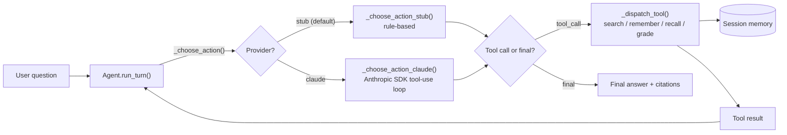

# Claude Agent SDK example

[](https://github.com/derekgallardo01/claude-agent-sdk-example/actions/workflows/ci.yml) [](LICENSE) [](#) [](https://codespaces.new/derekgallardo01/claude-agent-sdk-example)

**Docs:** [Getting started](docs/getting-started.md) · [Architecture](docs/architecture.md) · [Customization](docs/customization.md) · [Evaluation](docs/evaluation.md) · [Diagrams](docs/diagrams.md) · [FAQ](docs/faq.md)

**Live demo:** [derekgallardo01.github.io/claude-agent-sdk-example](https://derekgallardo01.github.io/claude-agent-sdk-example/) — full scripted run with tool calls, citations, and the agent transcript, regenerated on every push.

A production-shaped multi-tool Claude agent. **Coordinator + tools +
memory + outcomes/grader**, with the Claude Agent SDK as the
provider-swap point.

Default backend is a deterministic stub — so the kit runs anywhere with
zero keys and zero setup. The single seam (`Agent._choose_action`) swaps
to the real Claude API by setting `CLAUDE_AGENT_PROVIDER=claude`.

```bash
pip install -e .
claude-agent-example     # runs the scripted demo against the stub provider
```

```bash
python -m pytest -q     # 16 unit tests covering tools + agent loop
python evals/run.py     # 5 golden eval cases (gates on the answer shape)
```

Stdlib-only Python in the default path. The Claude SDK (`anthropic`) is
an optional extra installed via `pip install -e ".[claude]"`.

## Run in Docker

```bash
docker build -t claude-agent-example .
docker run --rm claude-agent-example                       # runs the demo
docker run --rm claude-agent-example pytest -q             # runs the tests
docker run --rm -it claude-agent-example claude-agent-example --interactive
```

## What it's for

Most "agent" demos are a single LLM call dressed up with a system prompt.
This kit shows the **real shape** of an agent the Claude Agent SDK is
designed for — what a production deployment actually looks like once you
go past one prompt:

- **Coordinator** that decides each step (tool call vs final answer)
- **Custom tools** the agent can pick from (search, memory, grader)
- **Memory** that persists across turns within a session (the seam to
  Claude's `/mnt/memory/` for cross-session persistence)
- **Outcomes / grader** pattern for self-evaluating answers
- **Eval harness** that gates CI on whether the agent picks the right
  tool and cites the right source

The stub provider keeps all of this deterministic and free to run, so
the kit doubles as: a tutorial for the SDK, a starter template for a
real agent build, and proof that the demo works (without API keys) on
the live Pages demo.

## Tools

| Tool | What it does | When the agent picks it |
|---|---|---|
| `search_corpus` | Substring + word-overlap search across an in-memory corpus, returns top-k with snippets | Most user questions — the agent searches first, cites second |
| `remember` | Saves a key/value pair to session memory | User says "remember that ..." |
| `recall` | Reads a key from session memory; returns available keys if not found | User says "do you remember ..." or "recall ..." |
| `grade_response` | Scores a draft against a rubric of phrases; returns pass/fail per criterion | Self-check before returning a high-stakes answer |

Each tool is a pure function in [src/claude_agent_example/tools.py](src/claude_agent_example/tools.py) — testable in isolation, no transport layer.

## The provider seam

The entire "stub vs Claude" decision is one method:

```python
# src/claude_agent_example/agent.py
def _choose_action(self, user_message, scratchpad, session):
    if self.provider == "claude":
        return self._choose_action_claude(user_message, scratchpad, session)
    return self._choose_action_stub(user_message, scratchpad, session)
```

Everything else — tool dispatch, memory state, transcript building,
citation tracking, step-limit safety — is provider-agnostic. Swap the
selector, keep everything else.

`_choose_action_claude` ships with a documented implementation sketch
for the Anthropic SDK's tool-use loop. Wire it up when you're ready;
the stub keeps working in the meantime.

## Architecture



- [src/claude_agent_example/agent.py](src/claude_agent_example/agent.py) — the loop, the provider seam, the transcript
- [src/claude_agent_example/tools.py](src/claude_agent_example/tools.py) — 4 pure-function tools + JSON schemas
- [src/claude_agent_example/cli.py](src/claude_agent_example/cli.py) — scripted demo + REPL
- [evals/run.py](evals/run.py) — golden eval harness (gates CI)
- [tests/](tests/) — 16 tests across the tool surface and the agent loop

## Wiring to the real Claude API

1. `pip install -e ".[claude]"`
2. `export ANTHROPIC_API_KEY=...`
3. Set `CLAUDE_AGENT_PROVIDER=claude`
4. Implement `_choose_action_claude` per the docstring sketch — about
   30 lines of glue against the Anthropic SDK's tool-use loop. The same
   tool functions get called; only the selector changes.

The kit is built so you can do the wiring incrementally — every test
still runs against the stub, so you can verify the orchestration
without burning tokens.

## What's inside

| Path | Purpose |
|---|---|
| `src/claude_agent_example/agent.py` | Agent loop + provider seam |
| `src/claude_agent_example/tools.py` | 4 tool implementations + schemas |
| `src/claude_agent_example/cli.py` | Scripted demo + REPL |
| `tests/test_tools.py` | 9 tool tests |
| `tests/test_agent.py` | 7 agent-loop tests |
| `evals/golden.json` | 5 eval cases |
| `evals/run.py` | Eval harness |
| `examples/corpus.md` | Sample corpus walkthrough |
| `pyproject.toml` | Package + `claude-agent-example` script entry |

## Companion repos

- [m365-audit-mcp](https://github.com/derekgallardo01/m365-audit-mcp) — the **server** side: MCP tools the Claude Agent SDK consumes. Pair this kit with that one to see the full agent ↔ tool ↔ MCP loop.
- [rag-over-docs-kit](https://github.com/derekgallardo01/rag-over-docs-kit) — drop-in replacement for `search_corpus` if you want real retrieval (TF-IDF + re-ranking + golden evals).
- [copilot-studio-support-agent](https://github.com/derekgallardo01/copilot-studio-support-agent) — the same orchestrator pattern, inside M365's hosted Copilot Studio runtime instead of an SDK build.
