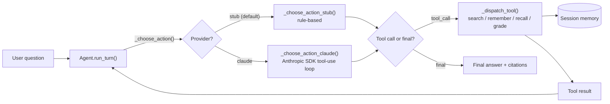
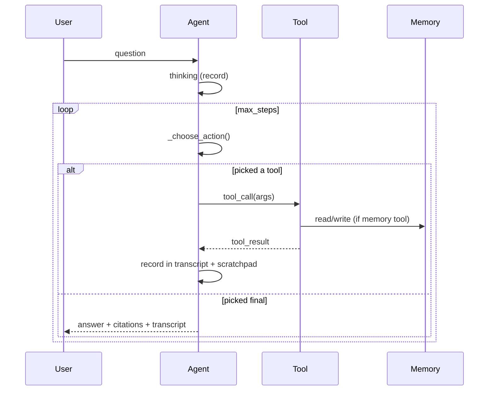
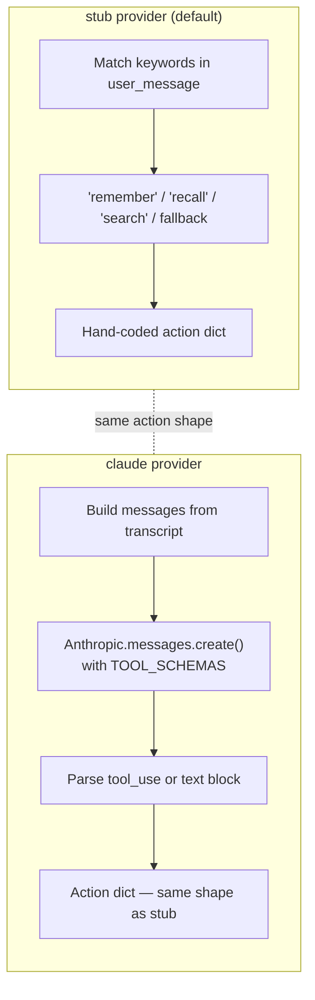
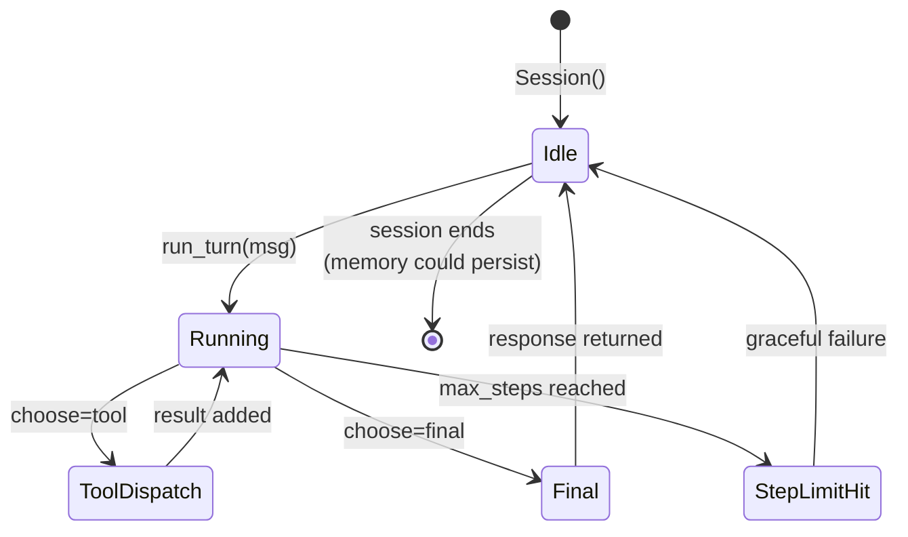
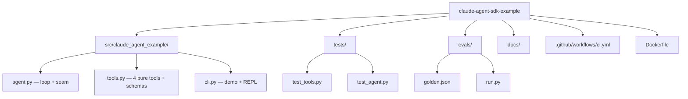

# Diagrams

GitHub renders Mermaid natively. These render on the README and in this file.

## End-to-end flow

## The loop, step by step

## Stub vs Claude

The action dict is identical — `{"type": "tool_call", "tool_call": ToolCall(...)}`
or `{"type": "final", "text": str}`. Downstream code doesn't know
which path produced it.

## Session lifecycle

## Repo shape

